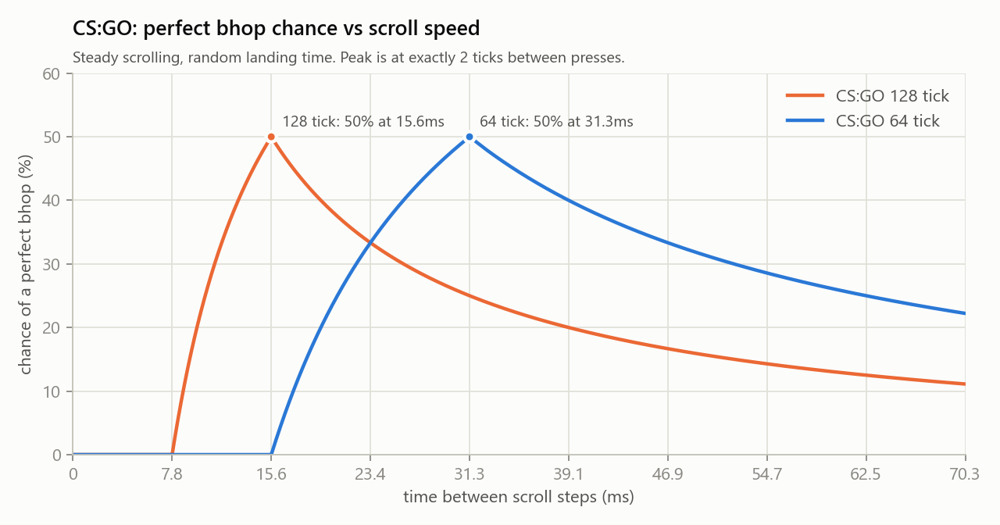
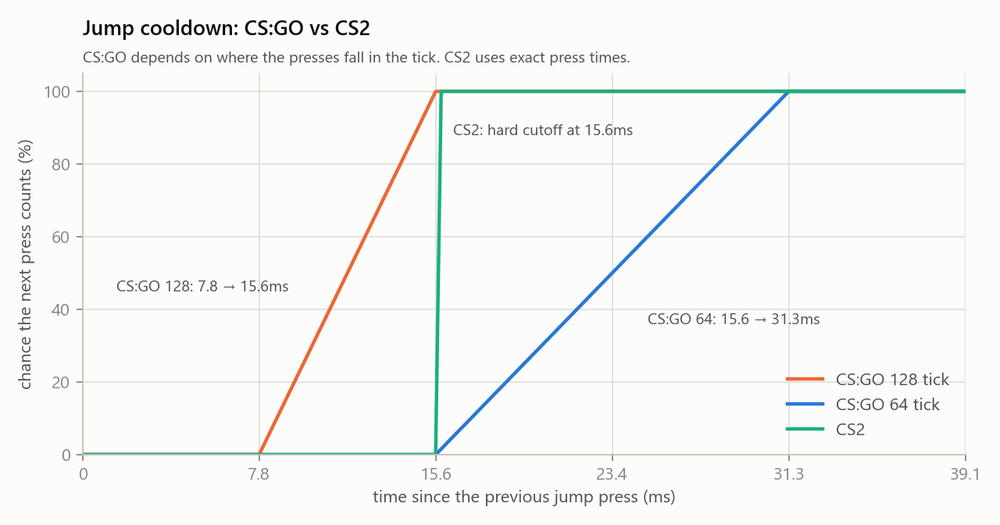
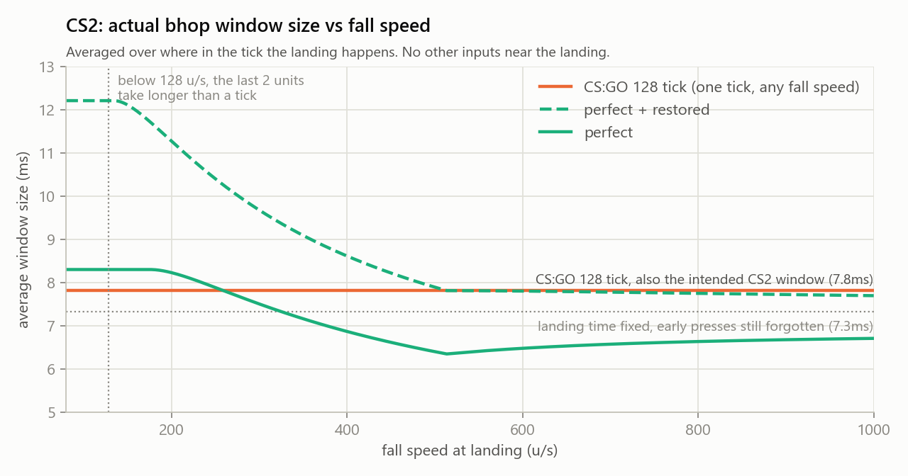
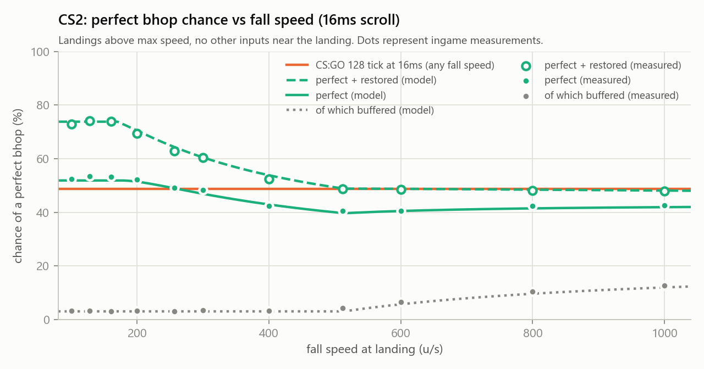
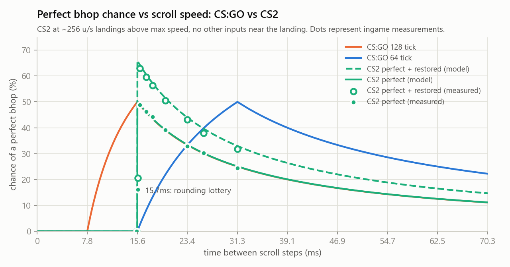

# Bunnyhopping in CS2

This is a writeup of how bunnyhopping works in CS2 compared to CS:GO, and why perfect bhops in CS2 feel inconsistent (possibly). 

It is based on reverse engineering CS2's movement code. 

The numbers were derived from the code and then checked in game with about 130,000 automated bot landings (see [Measured in game](#measured-in-game)).

A PDF version of this document, including the appendix, is available as [bunnyhopping-in-cs2.pdf](bunnyhopping-in-cs2.pdf).

# TL;DR

CS:GO was simple. It was tick perfect, meaning the jump had to be in the first tick on the ground, which gave a one tick window and at best a 50% perf rate at the ideal scroll speed. CS2 works differently in several ways, and each one changes what a player should do.

- **Scroll at about 16ms per notch (50 to 60 per second).** The jump cooldown is a hard 15.625ms cutoff, and because press times are rounded, anything under about 15.9ms between presses is partly or fully locked out. It's better to be a little slow than a little fast.
	- Coming from 64 tick CS:GO, scroll about twice as fast as before.
	- Coming from 128 tick CS:GO, scroll a little slower than before. Going slightly faster than 15.625ms per scroll step used to still give you a somewhat decent chance to jump, but that is no longer the case in CS2.
	- At 16ms per jump input, a normal flat bhop is perfect about 49% of the time in game (64% counting restored bhops).
- **Set `fps_max` to a multiple of 62.5 or slightly below it (125, 250, 500...), and avoid the range just above it up to the next multiple of 64 (e.g. 252–256, 504–512)**. Your scroll steps get rounded to the frame grid, and on those caps the frame step closest to the ideal timing is exactly 16ms, which always gets through. See [fps_max and consistent bhop timing](#fps_max-and-consistent-bhop-timing).
- **Don't press or release movement keys right as you land**. Even with `sv_bhop_time_window`, CS2 is still mostly frame perfect, so a true perfect bhop almost always needs the jump to be the very next input after the player is (effectively) on the ground. Any other key press or release in between (strafe keys, W, duck, attacking while turning) turns it into a restored bhop or a miss. Finish the A/D strafe switch before touchdown, or do it after the jump.
- **Perfect bhops are impossible at low speed**. A jump inside the bhop window can be a real perfect bhop (frame perfect or buffered), a restored bhop (speed kept, but the jump starts later and from the floor, so its height differs), or a deferred jump (a full tick on the ground). Landing at or below max speed always gives a deferred jump no matter the timing, so you will never get the extra height from perfect bhops (which is what matters here).
- **Bhopping up onto higher ground is easier than flat ground, and dropping down is harder**. A jump input while you're within 2 units of the floor counts as a perfect bhop, as long as you have enough horizontal speed and it's your first input in that range before a tick ends (after a tick end it can still be restored, which keeps your speed but not your height). The time you spend in those 2 units is roughly inversely proportional to how fast you're falling, so the slower you land, the bigger the window. With perfect scrolling you keep your speed about 63% of the time on flat ground, up to about 74% when landing on something 24+ units higher (it stops improving past that), and only about 48% after a big drop (1000 u/s).
- **Ledgegrabs don't really interact with the new bhop mechanics**. Ledgegrabbing (landing on the ground while still going up) completely bypasses the new bhop mechanics, because a landing is only recorded when you're falling. There is no window and no restore, and the jump only keeps your speed if it comes after you're within 2 units of the ledge and before the next tick ends or any other input happens. Depending on timing that's anywhere from nothing to one tick, instead of CS:GO's full tick. The same issue applies to crouchbugs/jumpbugs.
- **For jumpbugs, use a mouse wheel `+alias`/`-alias` bind and consider a lower fps cap**. A jumpbug needs the unduck and the jump in the same client frame, which is only practical when one scroll step sends both. Frame perfect inputs get easier at lower fps because frames are longer. On high fps values, a legitimate jumpbug with no alias could easily take 5 minutes to hit, even for an experienced player.

Table of Contents:
- [Bunnyhopping in CS2](#bunnyhopping-in-cs2)
- [TL;DR](#tldr)
- [The basics](#the-basics)
	- [Ticks](#ticks)
	- [What a perfect bhop is](#what-a-perfect-bhop-is)
- [How it worked in CS:GO](#how-it-worked-in-csgo)
	- [The jump check](#the-jump-check)
	- [The perf window](#the-perf-window)
	- [The jump cooldown](#the-jump-cooldown)
	- [Ideal scroll speed and perf rate](#ideal-scroll-speed-and-perf-rate)
- [What changed in CS2](#what-changed-in-cs2)
	- [Subtick basics](#subtick-basics)
	- [The bhop window](#the-bhop-window)
	- [Bhop window spaghetti #1: The landing time is wrong](#bhop-window-spaghetti-1-the-landing-time-is-wrong)
	- [Bhop window spaghetti #2: Flawed jump buffering](#bhop-window-spaghetti-2-flawed-jump-buffering)
	- [Frame perfect instead of tick perfect](#frame-perfect-instead-of-tick-perfect)
	- [Crouchbugs and jumpbugs](#crouchbugs-and-jumpbugs)
	- [The jump cooldown is... different](#the-jump-cooldown-is-different)
	- [Ideal scroll speed and perf rate in CS2](#ideal-scroll-speed-and-perf-rate-in-cs2)
	- [fps\_max and consistent bhop timing](#fps_max-and-consistent-bhop-timing)
	- [Measured in game](#measured-in-game)

# The basics

## Ticks
The server simulates movement in fixed steps called ticks. CS2 runs at 64 ticks per second, so one tick is 15.625ms. CS:GO ran at 64 on matchmaking and 128 on most community and third party servers (7.8125ms per tick).

## What a perfect bhop is
When the player lands, the ground movement code (`WalkMove`) starts running. The first time it runs, it clamps the player's speed down to their max speed (depends on the weapon), which is temporarily lowered even further right after a landing. After a normal flat bhop landing that is about 75% of max speed, so a single `WalkMove` takes a 275 u/s player down to about 185 u/s. Friction also applies, but over a few milliseconds it removes significantly less than the initial speed clamp.

A (true) perfect bhop is a jump that happens before `WalkMove` ever runs after landing. The player keeps all of their speed, and the only limit is the bunnyhop speed cap from `sv_enablebunnyhopping 0`, which cuts speed down to 286 u/s (1.1 × 260, regardless of the weapon held). The player's height is also kept as is, which matters because the player can be up to 2 units above the ground when they land (more on that [later](#bhop-window-spaghetti-1-the-landing-time-is-wrong)).

If `WalkMove` runs even once before the jump, the player gets clamped down to max speed and snapped down to the floor.

# How it worked in CS:GO

## The jump check
Every tick, the game checks the jump button *before* running `WalkMove`.

```c++
// gamemovement.cpp, FullWalkMove
if (mv->m_nButtons & IN_JUMP)
    CheckJumpButton();
...
if (player->GetGroundEntity() != NULL)
    WalkMove();
```

Whether the player is on the ground is typically decided at the end of the previous tick. So if the player lands at some point during tick 100, tick 101 is the first tick where the game sees them on the ground, and it checks the jump button before `WalkMove` runs.

There are two things inside `CheckJumpButton` that can stop the jump. If the player is in the air, nothing happens and the press is not remembered. If jump was already held in the previous tick's input, the jump is blocked.

## The perf window
Putting that together, a perfect bhop in CS:GO needs the jump input to be in the input packet of the first tick on the ground, and *not* in the input packet of the tick before that.

The perf window is therefore exactly one tick, which is 15.625ms on 64 tick and 7.8125ms on 128 tick. It doesn't matter where in the tick the player pressed jump or where in the tick they actually landed, only which tick's packet the press ended up in.

## The jump cooldown
Because of the second rule, after a jump press the player needs a full tick with no jump input before the next press counts. How long they actually have to wait depends on where in the tick the first press was:
- If they pressed at the very start of a tick, they have to wait up to two ticks.
- If they pressed at the very end of a tick, the next tick can be empty even if they wait just over one tick.

On 128 tick, this means that a press that happens less than 7.8ms after the last press is always ignored, and the chance of it being ignored then drops linearly to 0% at 15.6ms.

## Ideal scroll speed and perf rate
Scrolling puts a jump press roughly every X ms. For a scroll bhop to be perfect, one of those presses needs to fall into the one tick packet that matters, and the packet before it needs to be empty.

Therefore, the best spacing between scroll steps is exactly 2 ticks (31.25ms on 64 tick, 15.625ms on 128 tick). That alternates between a packet with jump and a packet without, so every other tick is a valid perfect bhop tick, which gives a **50%** chance of hitting a perfect bhop.

Going either faster or slower reduces the odds. Slower means fewer presses land in the right tick (3 tick spacing gives 33%), and faster means some presses land in the tick right before the right one and block it (1.5 tick spacing also gives 33%).



# What changed in CS2

The subtick system in CS2 significantly complicates the situation.

## Subtick basics
In CS2, inputs are timestamped with when they happened inside a tick (with a minimum resolution of ~0.244ms, or 1/4096 s). Instead of simulating the whole tick in one go, the server splits the tick at every input and simulates each piece separately. These pieces are called subtick moves. For example, if the player presses A at 30% into the tick and jump at 80% into the tick, the tick is simulated as three subtick moves, 0-30%, 30-80% and 80-100%.

Each subtick move runs the full movement code. It checks the jump button at the start, then runs `WalkMove` (or air movement), then checks whether the player is on the ground at the end.

The tick gets split whenever the player presses or releases forward, back, left, right, jump or duck, and on attack inputs if the player's view moved. The game also adds a few splits on its own (landing related splits, friction and grenade related splits).

## The bhop window
CS2 no longer uses the CS:GO "one tick on the ground" rule. Instead it has `sv_bhop_time_window` (default 0.0078125s, which is exactly one 128 tick). A jump pressed within half of that window (3.9ms) before or after landing is supposed to count as a bhop[^1].

[^1]: This doesn't actually work as intended for multiple reasons (see the spaghetti sections).

If the press is in the window and the player landed faster than their max speed, the game restores the horizontal speed the player had at the moment of landing, undoing the clamping that happened in between.

This means a jump inside the window can end up in several different ways, and only the first two are real perfect bhops.

1. A **frame perfect bhop** happens when the jump press is the input that ends the subtick move in which the player lands. The press either happens while the player is already within the last 2 units above the floor (see [below](#bhop-window-spaghetti-1-the-landing-time-is-wrong)), or right after they touch the floor with no other input in between. The jump starts at the moment of the press, before `WalkMove` runs, and speed and height are kept as is. This is the CS:GO idea of "jump on the first moment on the ground", except the "moment" is now a client frame instead of a tick.
2. A **buffered perfect bhop** happens when the jump press comes slightly before landing, in the same subtick move as the landing, with no other input in between. Nothing happens at the press yet since the player is still in the air. The player lands at the end of that move, and the remembered press fires at the start of the next move (usually the start of the next tick), still before `WalkMove`. Speed and height are kept, but the jump starts at the tick boundary instead of at the press. This is the "before landing" half of `sv_bhop_time_window` doing what it's supposed to do, but as explained below, it doesn't really work most of the time.
3. A **restored bhop** happens when `WalkMove` ran at least once before the jump (because a tick ended or another input happened in between), but the player landed above max speed. Horizontal speed is restored from the landing speed, but the jump itself is different from a perfect one. The player gets snapped down to the floor by `WalkMove` before jumping, so if they were hovering (up to 2 units above the floor), that height is lost. The jump also starts later than the landing, and if the player was already on the floor (collision landing), that later start can instead give an ever so slightly higher jump than a perfect bhop would have.
4. A **deferred jump** happens when the player landed at or below max speed. The game refuses to jump until one full tick after landing, no matter when inside the window they pressed, so the player always spends a whole tick on the ground, just like a missed bhop in CS:GO. The pseudocode below shows why.

```c++
// OnJump
if ( bInWindow )
    bUseLandingVelocity = landingSpeed > maxSpeed;   // only restore above max speed

if ( bUseLandingVelocity )
{
    // restore landing speed
}
else
{
    // A regular jump can't happen in the same tick we landed
    if ( now < landed + 1 tick )
        return;
}
```

So if the player lands below max speed, a perfect bhop (either kind) is not possible at all, no matter how good their timing is. The two exceptions are ledgegrabs and [jumpbugs](#crouchbugs-and-jumpbugs), which skip this system entirely (and frame perfect rules apply instead).

Keep in mind that `maxSpeed` here includes the landing penalty (the modern jump code's replacement for stamina), which temporarily lowers the max running speed right after a landing (to roughly 75% of normal after a flat ground bhop) and the speed of the next jump (to roughly 88%).

## Bhop window spaghetti #1: The landing time is wrong
The bhop window is measured around the landing time. To get it, the game doesn't just use the tick the player landed in. When it detects the player on the ground at the end of a subtick move, it solves the player's fall motion to work out exactly when during that move they reached their final position. If the player hit the floor during the move, that's the exact moment of contact, which is what the window is meant to be centered on.

The problem is that the game also puts the player on the ground when they haven't hit the floor yet. At the end of each subtick move, it checks for ground up to **2 units below** the player, and if there is any, the player is considered on the ground even though they're still hovering above it. The player's final position for that move is in the air, so the calculation just returns the end of the move, and that becomes the landing time. **It's earlier than the moment the player would have touched the floor**.

How much earlier that is depends on how fast the player is falling.

| Fall speed | Time to fall the last 2 units |
|---|---|
| 200 u/s | 10.2ms |
| 260 u/s | 7.8ms |
| 300 u/s | 6.7ms |
| 400 u/s | 5.0ms |
| 512 u/s | 3.9ms |

This gives a weird result. Since a jump press is itself a split, pressing jump while the player is inside those last 2 units will ground the player at the moment of the press, and record the landing as the press time. The press is then exactly on the landing time, so it's always inside the window.

In other words, **every press inside the last 2 units of the fall counts**, no matter how long that takes. At 260 u/s that is 7.8ms, which is almost twice the 3.9ms the window is supposed to give before landing.

If the player falls slower than about 128 u/s, the last 2 units take longer than a whole tick. A tick always ends while they're inside that range, so the recorded landing time is never the moment of contact. It's always the first tick end (or input) after the player gets within 2 units, up to a full tick or more before they would have touched the floor. This mostly happens when landing on a higher block.

However, there's a flip side. If a tick ends, or the player presses any other key, while they're inside those last 2 units, the player gets grounded at that moment instead. `WalkMove` then runs in the next move, and any jump after that is at best a restored bhop (no bonus height).

Landing while still going up (onto a ledge, or right at the top of a jump) is a separate case. The game only records a landing if the player was falling when the subtick move started. If they're still rising, no landing is recorded at all and the game keeps using the landing from before the jump, so the bhop window can never be hit. The player can still keep their speed by pressing jump before `WalkMove` runs, but there is no restore, no penalty and no window, only "press before the next input or tick end".

## Bhop window spaghetti #2: Flawed jump buffering
The window is supposed to allow jumps up to 3.9ms before landing. The game remembers a jump press made in the air so that it can be used when the player lands. However, the game re-checks that remembered press at the start of every subtick move.

```c++
// CheckJumpButton, when no new jump press happened
TickFraction_t usable = GetLastUsableJumpPress();
if ( usable >= GetBhopWindowStart() )
{
    if ( usable < GetBhopWindowEnd() )              { OnJump( mv ); return; }
    if ( usable < GetLastLanded() + 1 tick )        { OnJump( mv ); return; }
}
// forget the press
m_nLastUsableJumpPressTick = JUMP_PRESS_TICK_NONE;
```

The window is centered on `GetLastLanded()`. While the player is still in the air, that is the landing *before* the current jump, which was most of a second ago. The remembered press is compared against that old landing, looks way too late, and gets thrown away. A few milliseconds later the player lands, and there's no press left to use.

The only way an early press survives is if the player lands in the same subtick move as the press, meaning the same tick, with no other input in between. If the player lands 50% into a tick, a press up to 3.9ms before landing works as intended. If the player lands 10% into a tick, only presses in that first 10% of the tick (1.6ms) work, and anything in the previous tick is forgotten. And if any other input happens between the press and the landing, the press is forgotten as well.

Combined with the 2 unit landing issue, the actual window ends up being shifted early, and its size depends on how fast the player is falling, where in the tick they land, and what other inputs they make around the landing.

```
intended:                         [-3.9ms ......... landing ......... +3.9ms]
actual (260 u/s, no other input): [-7.8ms ................. landing ... +3.9ms]
```

The earlier part (inside the last 2 units) gives perfect bhops. The later part is often a restored bhop, depending on whether a tick ends in between.

The buffered kind of perfect bhop (a press made just before the last 2 units) almost never happens at normal fall speeds. A buffered press has to be made *before* the player enters the last 2 units, since a press inside them grounds the player on the spot and is frame perfect instead. It also can't be *more than 3.9ms before* the recorded landing time.

- If the player touches the floor during a subtick move, the landing time is the moment of contact. At normal fall speeds that is more than 3.9ms after the player entered the last 2 units, so no press made before them can be in the window.

- If a tick ends while the player is inside the last 2 units, they get grounded at that tick end, and the landing time moves earlier to that tick end. A buffered press then works if it falls between (tick end − 3.9ms) and the moment the player entered the last 2 units. That range only exists if the tick end comes less than 3.9ms after the player entered them, and it's `3.9ms − (time from entering the last 2 units to the tick end)` wide.

For example, at 260 u/s the player enters the last 2 units at 13.0ms, the tick ends at 15.625ms, and they would touch the floor at 20.8ms. The landing time becomes 15.625, and a press between 11.7ms and 13.0ms is a buffered perfect bhop, a 1.3ms range. Averaged over where in the tick the landing happens, that's about 0.5ms worth of window. It only becomes significant on hard landings (faster than ~500 u/s), where the last 2 units take less than 3.9ms, so part of the 3.9ms before contact is always outside them. 

In testing, buffered perfects make up about 3% of landings up to 512 u/s, then 6%, 11% and 14% at 600, 800 and 1000 u/s, exactly as predicted.

## Frame perfect instead of tick perfect
In CS:GO, the player had a whole tick to get their jump in. The game only looked at which tick the input landed in.

In CS2, a perfect bhop almost always needs the jump to be the **very next input** after the player becomes grounded. The only exception is the rare buffered case (2) described above. Any other input in between (strafing with A/D, releasing W, attacking while turning...) splits the tick, the move after that split runs `WalkMove`, and the bhop is no longer perfect. At best it becomes a restored bhop (speed kept, different jump height, usually lower), and at worst the player gets clamped.

Since inputs are sent per client frame, this makes perfect bhops frame perfect rather than tick perfect. Players who strafe a lot right before landing, and players with higher fps (more frames means more places where inputs can split the tick), are more likely to lose the perfect bhop to one of their own inputs.

The buffered kind of perfect bhop has the same problem in the other direction. Any input between the early jump press and the landing splits the tick, and the remembered press gets thrown away (see [above](#bhop-window-spaghetti-2-flawed-jump-buffering)).

## Crouchbugs and jumpbugs
A crouchbug is when the player lands by unducking in the air. Unducking in the air moves the player's feet down by 9 units. If the feet end up within 2 units of the floor, the player is classified as "on the ground" right away. So if the player unducks while their (ducked) feet are 9 to 11 units above the floor, they land instantly.

In CS, this landing happens inside the duck code, before the jump check and before `WalkMove`. Because the player is already on the ground when `WalkMove` runs, `WalkMove` resets their fall speed to zero, and the game never records a landing. That means no fall damage and no landing penalty (stamina in CS:GO). In CS2, the bhop window is never involved either.

A jumpbug is a crouchbug combined with a perfect bhop. The player unducks and jumps at the same time, so they land and jump off again without `WalkMove` ever running. Since no landing is recorded, the "can't jump in the same tick you landed" rule is checked against the old landing and always passes, so a jumpbug keeps the player's speed even below max speed. It is the purest form of the frame perfect case.

In CS:GO, both were tick perfect. The unduck had to be in the input packet of the tick where the player's feet were 9 to 11 units above the floor. The player's position is only checked once per tick, so if they fall more than 2 units per tick, that tick might not exist. On 64 tick that's any fall faster than 128 u/s, so it failed on a lot of normal jumps. On 128 tick it's any fall faster than 256 u/s, which is fine for most flat jumps but still fails on big drops.

Whether that tick exists only depends on the jump itself (where it started, how high it went, and where it lands). Jumps start on tick boundaries and movement is simulated in whole ticks, so the same jump always passes through the same heights at every tick. This makes CS:GO deterministic, since a given jump either always allows a crouchbug/jumpbug or never does, and players could learn which ones work. For a jumpbug, the jump also had to be in the same tick's packet as the unduck, but anywhere within the same 7.8ms (128 tick) or 15.6ms (64 tick) was fine, and it could be done with a single `alias` bind.

In CS2, subtick makes this exceedingly complicated.

The unduck is processed at its exact subtick time, so there is always a moment where the feet are in the 9 to 11 unit range. But the player has to unduck within that range, which is only about 2 units of falling (~7.8ms at 260 u/s). There is no longer a fixed answer to "is this jumpbug possible". Every attempt is possible in theory and depends on timing instead (and luck, since you need a frame to happen when you are within that range, see the note about low fps below).

For a jumpbug, the jump press has to be processed in the **same subtick move** as the unduck, which means both inputs have to be in the same client frame. If jump is pressed a frame later, the subtick move between the two inputs runs `WalkMove` on the ground and the player loses speed (commonly known as noperf in CS:GO). If jump is pressed a frame earlier, the player is still in the air. The press is remembered, but then thrown away by the same stale landing check that breaks the pre-window (the player never has a new landing recorded here, so it's compared against an old one from long ago).

This is therefore fps dependent. At 100 fps a frame is 10ms, at 300 fps it's 3.3ms, and at 500 fps it's 2ms. The lower the fps, the more time there is to get both inputs into the same frame, so frame perfect inputs get easier at low fps and harder at high fps. The same applies to the frame perfect kind of bhop, since fewer frames means fewer extra inputs that can split the tick near the landing.

Since inputs can only happen once per frame, if a frame is longer than the time the feet spend in the 9 to 11 unit range, there may be no frame at all where the unduck lands in range. This is the same problem CS:GO had with its ticks, except frames aren't aligned to anything, so it's random per attempt instead of fixed per jump.

CS2 blocks binding multiple commands to one key, so the CS:GO approach of putting both inputs in one alias doesn't work. Pressing jump and releasing duck on two separate keys within the same frame, while also timing that frame to land inside a perf window, is exceedingly difficult to do consistently.

You can actually cheese this using the mouse wheel. Scroll inputs run both the `+` and `-` half of a bound `+alias` on the same scroll step, which is the same frame. So a `+alias` that does one input and a matching `-alias` that does the other, bound to the mouse wheel, sends both in the same frame on every scroll step. For example, with duck held on another key:

```
alias +jb "+jump"
alias -jb "-duck"
bind mwheeldown +jb
// (don't actually use this, you will block yourself from jumping later because it needs a -jump somewhere as well)
```

This turns the jumpbug from "two keys in the same frame" into "one scroll step at the right time", with the right time still being the window where the feet are 9 to 11 units above the floor.

## The jump cooldown is... different
`sv_jump_spam_penalty_time` (15.625ms) ignores any jump press that comes within 15.625ms of the previous one. An ignored press still counts as "the previous press" for the next one, so scrolling too fast keeps resetting the timer and nothing gets through.

The check uses the subtick time of both presses, but the server rounds every subtick time to 1/64 of a tick (0.24ms) first. A gap of 15.625ms or less never counts, and a gap of more than about 15.9ms always counts. Anything in between is a lottery. Depending on how the two presses get rounded, the gap comes out as exactly one tick (ignored) or one tick plus 1/64 (counts). A steady scroll at 15.7ms only gets about 1 press in 3 through, and in testing 37% of landings got no jump at all.

This replaces the CS:GO ramp. On 128 tick CS:GO, gaps between 7.8ms and 15.6ms worked some of the time. In CS2 they never work. The CS2 cutoff sits exactly where CS:GO 128 tick reached 100%. **If you feel like you have to scroll differently to bhop in CS2, this is most likely why.**



## Ideal scroll speed and perf rate in CS2
With CS:GO's rule gone, scroll timing works differently. If the player scrolls with a steady gap between notches and the window is W ms wide, the chance that one of the presses lands inside the window is W divided by the gap, capped at 100%.

```
chance = window size / gap between presses   (at most 100%)
```

Think of dropping a stick of length W onto a fence with posts every "gap" ms. The chance it touches a post is W / gap, or 100% if the stick is longer than the gap.

The gap can't be shorter than the cooldown, and in practice has to be about 15.9ms because of the rounding lottery described [above](#the-jump-cooldown-is-different). So the ideal scroll speed is **about 16ms per notch** (about 60 notches per second). This is twice as fast as 64 tick CS:GO. A player with a 64 tick CS:GO scroll rhythm (31.25ms) only gets half the perf rate they could get.

At a 16ms gap, the average odds (assuming no other inputs and a random landing position within the tick) are shown below.

| Fall speed | Perfect window | Perfect + restored window | Perfect odds | Perfect + restored odds | Measured (perfect / + restored) |
|---|---|---|---|---|---|
| 160 u/s or slower | ~8.3ms | ~12.0ms | ~52% | ~74% | 52–54% / 73–74% |
| 200 u/s | ~8.2ms | ~11.3ms | ~51% | ~70% | 52% / 70% |
| 256 u/s (≈ sustained bhop) | ~7.8ms | ~10.3ms | ~49% | ~64% | 49% / 63% |
| 300 u/s (≈ first bhop) | ~7.5ms | ~9.7ms | ~47% | ~60% | 48% / 60% |
| 400 u/s | ~6.9ms | ~8.6ms | ~43% | ~54% | 42% / 53% |
| 512 u/s | ~6.4ms | ~7.8ms | ~40% | ~49% | 41% / 49% |
| 1000 u/s | ~6.7ms | ~7.7ms | ~42% | ~48% | 43% / 48% |
| any speed, landing below max speed | 0 | 0 (always deferred) | 0% | 0% | |

Both graphs below include 128 tick CS:GO as a reference. Its window is always one tick (7.8ms) no matter how fast the player falls, which is also the size CS2's window was meant to have, and at a 16ms scroll its perfect chance is 48.8% at any fall speed.





Against scroll speed, the CS2 perfect chance at 256 u/s ends up on almost the same curve as 128 tick CS:GO above 15.9ms, but it drops to zero below that instead of tapering off.



Almost all of the perfect window is the frame perfect kind. At 256 u/s it's about 7.3ms frame perfect (~46%) and 0.5ms buffered (~3%).

For reference, if the landing time was calculated correctly (the moment the player touches the floor) but early presses were still forgotten, the window would be about 7.3ms (~46%) regardless of fall speed. With both issues fixed it would be the full 7.8ms (~49%).

For anyone curious, here is roughly how the numbers are worked out. The full formulas behind every graph, and a step by step guide to deriving them, are in the [appendix](appendix.md).

Let `d` be the time to fall the last 2 units (under gravity, so slightly longer than 2 / fall speed), and `w` be half the window (0.25 tick), with everything measured in ticks. If nothing splits the tick near the landing, the perfect + restored window is the last 2 units plus the 3.9ms after landing, `d + w`. If a tick ends inside the last 2 units, the player is grounded there instead, which cuts the window. Averaged over where in the tick the player lands, the cut is `(d² - w²) / 2`, so the average window is `d + w - (d² - w²) / 2`.

The perfect part alone is everything before the first tick end (or other input) after the player enters the last 2 units, which averages `d + w - d²/2 - w·d`. Of that, the buffered part only exists when a tick end falls less than `w` after the player enters the last 2 units, and averages `w²/2` (about 0.03 tick). The rest is frame perfect.

The odds are `window / gap` for each landing position, capped at 100%, then averaged. The cap matters for slow falls. When the window is longer than the gap between presses, one press is guaranteed to land in it, so averaging the window first and then dividing overstates the odds (by about 2.5 points at 128 u/s). Every other input near the landing shrinks the perfect part further and turns it into restored (or lost) bhops.

Unlike CS:GO, the odds are different for every jump depending on how fast the player falls, where in the tick they land, which other keys they press around the landing, and whether they landed above max speed. That is why perfect bhops in CS2 feel random even with consistent scrolling.

## fps_max and consistent bhop timing
Inputs are timestamped by the client frame they're processed in, so with a frame cap every scroll step lands on a grid of `1000 / fps_max` ms. However evenly you scroll, the gap between two jumps always comes out as a whole number of frames. That makes the choice of `fps_max` matter, because that gap then has to clear the cooldown *after* the 1/64 tick rounding described [above](#the-jump-cooldown-is-different).

A gap of g (in 1/64 tick units, 0.244ms each) always rounds to either the whole number below g or the one above it, and it only passes if the rounded result is at least 65 (15.87ms). If N frames is at least 15.87ms, even the lower rounding passes, so every N-frame gap works and the rhythm is a steady N frames. If N frames is between 15.625ms and 15.87ms, some N-frame gaps round down and get ignored (resetting the timer) while others pass, so the best rhythm becomes "N frames, sometimes N+1", which is the lottery again.

On paper, a cap of exactly N × 64 makes N frames exactly 15.625ms, so every N-frame gap would fail and the rhythm would always be N+1 frames. In practice this doesn't happen, because `fps_max` is only a maximum and the real frame rate flickers slightly below it. Frames are a bit longer than `1000 / fps_max`, which pushes N frames up into the lottery range, so a cap of exactly N × 64 behaves like the lottery too.

That also works in your favour on the good caps. Because the real frame rate only ever drops below the cap, frames can only get longer, and a gap that passes at the cap's exact frame time keeps passing.

Scrolling a frame too early is possible at any fps and always fails. The point is to make sure that when you scroll at the right pace, the frame count you land on always passes, and that it's as close to 16ms as possible. Then the same scrolling gives the same result every time, instead of sometimes getting rounded into the lockout.

Multiples of 62.5 (125, 187.5, 250, 312.5, 375, 500) make N frames exactly 16ms, which is the shortest fixed rhythm that always passes. Right above each of them is a bad range where N frames falls into the lottery. Because the real frame rate sits a little under the cap, that range reaches from about N × 63 to slightly above N × 64.

| Frames between jumps | Good (N frames = 16ms) | Bad (lottery) |
|---|---|---|
| 2 | 125 | 126 to just above 128 |
| 3 | 187.5 | 189 to just above 192 |
| 4 | 250 | 252 to just above 256 |
| 5 | 312.5 | 315 to just above 320 |
| 6 | 375 | 378 to just above 384 |
| 8 | 500 | 504 to just above 512 |

For example, this is what happens around 500 fps.

| fps_max | Fastest gap that always passes | Gap | Expected perfect (sustained flat bhop) |
|---|---|---|---|
| 490 | 8 frames | 16.3ms | ~48% |
| 500 | 8 frames | 16.0ms | ~49% |
| 505–512 | 8 frames, sometimes 9 | lottery | lower |
| 520 | 9 frames (as long as the real frame rate stays above 512) | 17.3ms | ~45% |

Caps slightly *below* a multiple of 62.5 are also fine. They keep the same fixed rhythm, just a little slower (at 245 fps, 4 frames is 16.3ms, about 48% instead of 49%). There's no need to go below the multiple for safety, since frame time flicker at the cap only makes the gap longer, never shorter.

The game doesn't allow `fps_max` below 64, so a cap where a single frame is 16ms (62.5 fps) isn't possible.

The cap doesn't scroll for you, and you still need to hit roughly the right pace, about 16–20ms per notch. What a good cap does is make the outcome of a given scroll pace consistent. On a good cap, a scroll that lands on the 16ms frame count always gets through. On a bad cap, the same scroll sometimes or always gets rounded into the lockout.

## Measured in game
All of the above was checked on a real CS2 server with a server-side test plugin.

1. Bots start by standing on flat ground.
2. For each landing, a bot is teleported into the air and dropped so it hits the floor at a chosen fall speed, with 275 u/s horizontal speed (above the speed cap). 
3. The plugin writes the bot's input for every tick itself, including the subtick timestamps, so jump presses happen at exact, known times. 4. Each scroll step is a press and release in the same input packet, like a real mouse wheel, and no other inputs are made around the landing. The landing position within the tick and the scroll phase are randomized for every landing.

The outcome (perfect, buffered, restored, jump a tick later, or no jump) is read from the server's own movement state, which includes when the player was grounded, the recorded landing time, whether `WalkMove` ran before the jump, and the speed before and after the jump.

To put each landing at a random point in the tick without changing the fall speed, every drop starts with a random downward speed of up to 12.5 u/s (one tick of gravity), and the drop height is adjusted so the bot still hits the floor at exactly the target speed. The time spent in the last 2 units is then the same for every landing, and the landing position within the tick is uniformly random, which is what a player dropping from a fixed height gets.

The first test varied the scroll speed, with 45,000 landings at about 256 u/s (5,000 per point, accurate to about ±1.4%).

| Gap between presses | Perfect (measured / model) | of which buffered | Perfect + restored (measured / model) |
|---|---|---|---|
| 15.5ms | 0.0% / 0% | 0.0% | 0.0% / 0% |
| 15.7ms | 16.1% / lottery | 1.2% | 20.5% / lottery |
| 16ms | 48.8% / 48.8% | 3.2% | 62.9% / 64.1% |
| 17ms | 46.2% / 45.9% | 2.8% | 59.6% / 60.3% |
| 18ms | 44.3% / 43.4% | 2.5% | 56.3% / 56.9% |
| 20ms | 39.1% / 39.1% | 2.4% | 50.6% / 51.3% |
| 23.4ms | 32.9% / 33.4% | 2.3% | 43.1% / 43.8% |
| 26ms | 30.2% / 30.0% | 1.7% | 37.9% / 39.4% |
| 31.25ms | 24.4% / 25.0% | 1.7% | 31.8% / 32.8% |

The second test varied the fall speed at a 16ms gap between presses, with 88,000 landings (8,000 per point, accurate to about ±1.1%).

| Fall speed | Perfect (measured / model) | of which buffered (measured / model) | Perfect + restored (measured / model) |
|---|---|---|---|
| 100 u/s | 52.4% / 51.9% | 3.2% / 3.1% | 72.9% / 73.8% |
| 128 u/s | 53.5% / 51.9% | 3.2% / 3.1% | 74.1% / 73.8% |
| 160 u/s | 53.2% / 51.9% | 3.0% / 3.1% | 73.9% / 73.8% |
| 200 u/s | 52.2% / 51.4% | 3.2% / 3.1% | 69.5% / 70.4% |
| 256 u/s (≈ sustained bhop) | 49.2% / 49.0% | 3.0% / 3.1% | 62.9% / 64.4% |
| 300 u/s (≈ first bhop) | 48.3% / 46.9% | 3.5% / 3.1% | 60.4% / 60.5% |
| 400 u/s | 42.3% / 42.9% | 3.3% / 3.1% | 52.5% / 53.8% |
| 512 u/s | 40.5% / 39.7% | 4.2% / 3.1% | 48.7% / 48.9% |
| 600 u/s | 40.6% / 40.5% | 6.6% / 5.7% | 48.6% / 48.8% |
| 800 u/s | 42.3% / 41.5% | 10.4% / 9.6% | 48.2% / 48.4% |
| 1000 u/s | 42.6% / 41.9% | 12.6% / 12.0% | 47.9% / 48.1% |

The measured perfect rates sit up to about 1.5 points above the model at slow falls, which is about what the 1/64 tick rounding of press times (not included in the model) adds.

The logs also confirmed a few things directly. 
- A press inside the last 2 units always records the landing at the press time and is always perfect, with the player jumping from up to 2 units above the floor.
- The window after the recorded landing ends exactly 0.25 tick (3.9ms) later, at every fall speed. 
- A `WalkMove` before the jump clamps the player to the (lowered) max speed straight away (e.g. 275 → 189 u/s), and a restored bhop puts it back. 
- Presses between 0.25 tick and 1 tick after the landing always jump exactly one tick after landing.
